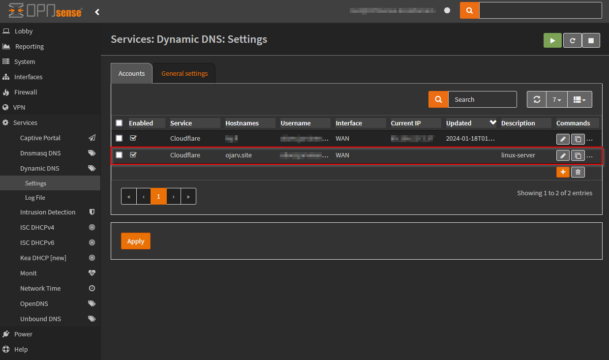

# h4 - Maailma kuulee

## x) Lue ja tiivistä.

[Susanna Lehto 2022: Teoriasta käytäntöön pilvipalvelimen avulla (h4)](https://susannalehto.fi/2022/teoriasta-kaytantoon-pilvipalvelimen-avulla-h4/)

* Step by step -ohjeet pilvipalvelimen vuokraamiseen, käyttöönottoon & konfiguroimiseen ja kotisivujen pystyttämiseen omalla domainilla.

[Karvinen 2012: First Steps on a New Virtual Private Server – an Example on DigitalOcean and Ubuntu 16.04 LTS](https://terokarvinen.com/2017/first-steps-on-a-new-virtual-private-server-an-example-on-digitalocean/)

* Käydään läpi miten manuaalisesti konfiguroidaan pilvipalvelin

## a) Vuokraa.
_Vuokraa oma virtuaalipalvelin haluamaltasi palveluntarjoajalta._

Käytän kurssin tehtäviin omaa palvelinta, joka pyörii minulla kotona. Pilvipalvelimen vuokraus ei ole mustaa magiaa, kuten aikaisemmasta Susannan artikkelista voidaan nähdä.

Sen sijaan oman palvelimen pyöritys vaatii hieman magiaa, että sen saa pyörimään budjetilla 24/7. Oma palvelimeni on viimeisen vuoden aikana ollut alhaalla lähinnä päivitysten (rauta ja softa) yhteydessä suunnitellusti.

### Pohjana:
* [Unraid](https://unraid.net/) 6.12.6 ([libvirt](https://libvirt.org/))
    * 12th Gen Intel® Core™ i5-12500
    * 64 GB DDR4
    * NVME/SSD massamuistia
* Virtuaalipalvelimeen asennetaan Debian 12 Bookworm -käyttöjärjestelmä
    * 4 CPU
    * 4 GB RAM
    * 20 GB virtual disk

### Alustus


Naputtelin asennuksen läpi vakioasetuksilla, paitsi _Software selection_ -kohdassa täppäsin vain vaihtoehdot _SSH server_ ja _standard system utilities_.


## b) Tee alkutoimet.
_Tee alkutoimet omalla virtuaalipalvelimellasi: tulimuuri päälle, root-tunnus kiinni, ohjelmien päivitys._

Virtuaalipalvelimen alustuksen jälkeen päästään kirjautumaan SSH-yhteydellä sisälle.

```console
$ ssh penguin@10.9.9.105
...
penguin@10.9.9.105's password:
Linux debian 6.1.0-17-amd64 #1 SMP PREEMPT_DYNAMIC Debian 6.1.69-1 (2023-12-30) x86_64

The programs included with the Debian GNU/Linux system are free software;
the exact distribution terms for each program are described in the
individual files in /usr/share/doc/*/copyright.

Debian GNU/Linux comes with ABSOLUTELY NO WARRANTY, to the extent
permitted by applicable law.
penguin@debian:~$
```

Ensitöikseen asennetaan ```SUDO``` ja lisätään asennuksessa luotu käyttäjä ```penguin``` SUDO-ryhmään sekä estetään ```root```-käyttäjällä kirjatuminen. Lisäksi laitetaan tulimuuri päälle ja avataan portit 22 (SSH) sekä 80 (Apache). Lisätietona, että tähän palvelimeen ei tule olemaan suoraa avointa yhteyttä ulkoverkosta.

```console
penguin@debian:~$ sudo
-bash: sudo: command not found
penguin@debian:~$ su root
Password:
root@debian:/home/penguin# apt-get update
...
Reading package lists... Done
root@debian:/home/penguin# apt-get upgrade
...
0 upgraded, 0 newly installed, 0 to remove and 0 not upgraded.
root@debian:/home/penguin# apt-get install sudo
...
The following NEW packages will be installed:
  sudo
0 upgraded, 1 newly installed, 0 to remove and 0 not upgraded.
...
root@debian:/home/penguin# sudo adduser penguin sudo
Adding user `penguin' to group `sudo' ...
Done.
root@debian:/home/penguin# sudo usermod -L root
root@debian:/home/penguin# exit
penguin@debian:~$ sudo apt-get install ufw
...
The following additional packages will be installed:
  iptables libip6tc2 libnetfilter-conntrack3 libnfnetlink0
Suggested packages:
  firewalld rsyslog
The following NEW packages will be installed:
  iptables libip6tc2 libnetfilter-conntrack3 libnfnetlink0 ufw
0 upgraded, 5 newly installed, 0 to remove and 0 not upgraded.
...
penguin@debian:~$ sudo ufw allow 22/tcp
Rules updated
Rules updated (v6)
penguin@debian:~$ sudo ufw allow 80/tcp
Rules updated
Rules updated (v6)
penguin@debian:~$ sudo ufw enable
Command may disrupt existing ssh connections. Proceed with operation (y|n)? y
Firewall is active and enabled on system startup
```

## c) Asenna weppipalvelin.
_Asenna weppipalvelin omalle virtuaalipalvelimellesi. Korvaa testisivu. Kokeile, että se näkyy julkisesti. Kokeile myös eri koneelta, esim kännykältä._

Asennetaan Apache ja konfiguroidaan se. Domain on jo valmiiksi vuokrattu [ojarv.site](ojarv.site), otetaan se huomioon konfiguraatioissa.

```console
penguin@debian:~$ sudo apt-get install apache2
...
penguin@debian:~$ mkdir -p /home/penguin/publicsites/ojarv.site/
penguin@debian:~$ echo ojarv.site > /home/penguin/publicsites/ojarv.site/index.html
penguin@debian:~$ cd /etc/apache2/sites-available
penguin@debian:/etc/apache2/sites-available$ sudo nano ojarv.site.conf
penguin@debian:/etc/apache2/sites-available$ cat ojarv.site.conf
<VirtualHost *:80>
 ServerName ojarv.site
 ServerAlias www.ojarv.site
 DocumentRoot /home/penguin/publicsites/ojarv.site
 <Directory /home/penguin/publicsites/ojarv.site>
   Require all granted
 </Directory>
</VirtualHost>
penguin@debian:/etc/apache2/sites-available$ sudo a2dissite 000-default.conf
Site 000-default disabled.
To activate the new configuration, you need to run:
  systemctl reload apache2
penguin@debian:/etc/apache2/sites-available$ sudo a2ensite ojarv.site.conf
Enabling site ojarv.site.
To activate the new configuration, you need to run:
  systemctl reload apache2
penguin@debian:/etc/apache2/sites-available$ sudo systemctl restart apache2
penguin@debian:/etc/apache2/sites-available$ chmod +x /home/penguin ## Fix permissions
penguin@debian:/etc/apache2/sites-available$ curl localhost
ojarv.site
```

## d) Vuokraa domain.
_Vuokraa domain-nimi ja aseta se osoittamaan virtuaalipalvelimeesi._

Vuokrasin domainin [namecheap.com](namecheap.com)-palvelusta vuodeksi. Siirrän domainin nimipalvelimet [Cloudflarelle](https://www.cloudflare.com/), jotta saan helposti reitittimeni päivittämään julkisen dynaamisen IP-osoitteeni domainille. Alla kuvituskuvia.

### OPNSENSE FIREWALL/ROUTER


### CLOUDFLARE


Samalla saan käyttöön [Cloudflaren proxy-toiminnon](https://developers.cloudflare.com/dns/manage-dns-records/reference/proxied-dns-records/#proxied-records), joka piilottaa virtuaalipalvelimen oikean julkisen IP-osoitteen Cloudflaren palvelimien taakse.

### REVERSE PROXY

Kuten aikaisemmin mainitsin, virtuaalipalvelimelta ei tulla avaamaan suoraan portteja julkiseen verkkoon, vaan siihen käännetään samassa verkossa toimiva [reverse proxy](https://en.wikipedia.org/wiki/Reverse_proxy).


Kuva: [Wikipedia, Reverse Proxy](https://en.wikipedia.org/wiki/Reverse_proxy)

Reverse proxy-toiminnallisuus toteutetaan käyttäen [Caddy-palvelinta](https://caddyserver.com/). Tämän avulla sivustolle generoituu automaattisesti SSL-sertifikaatti. Tässä lyhyesti sen konfiguraatio:

#### Caddyfile
```nginx
ojarv.site {
  reverse_proxy 10.9.9.105:80 {
  }
  header {
    Strict-Transport-Security "max-age=31536000; includeSubdomains"
    X-XSS-Protection "1; mode=block"
    X-Content-Type-Options "nosniff"
    X-Frame-Options "SAMEORIGIN"
    Referrer-Policy "same-origin"
  }
}
```

### [ojarv.site](https://ojarv.site)

Kävin muokkaamassa vielä lisäksi virtuaalipalvelimellani HTML-koodia. Kuvassa vasemmalla mobiilinäkymä.


## Tehtävänanto

https://terokarvinen.com/2024/linux-palvelimet-2024-alkukevat/
