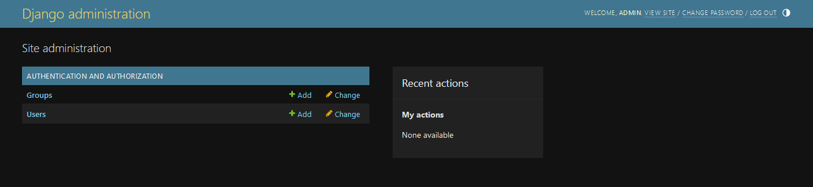
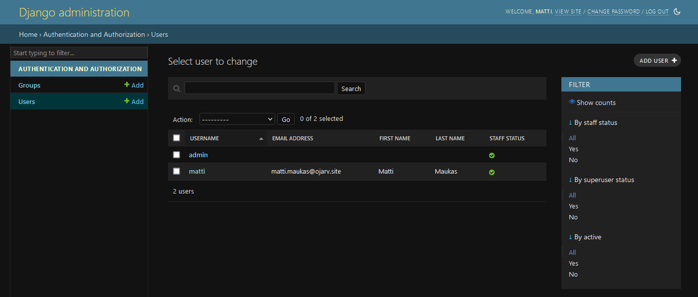
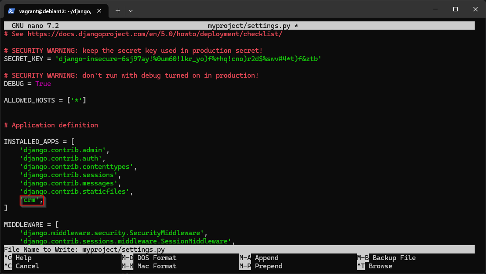
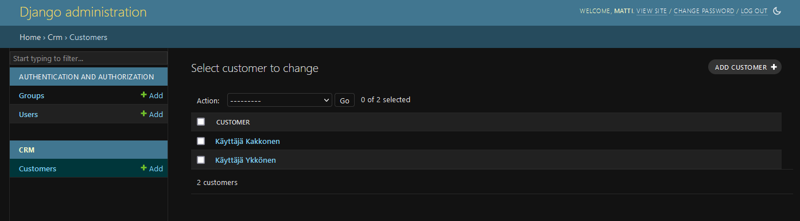
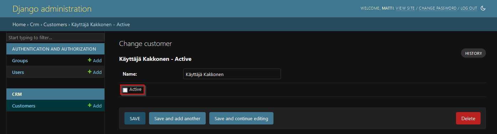
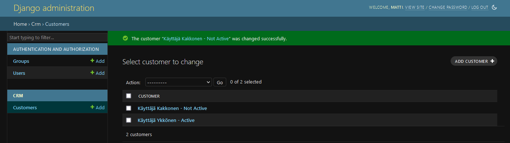
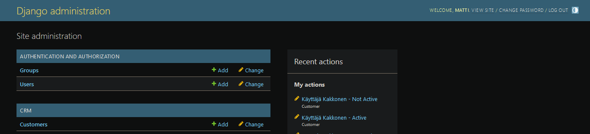

# h6 - DJ Ango

## x) Lue ja tiivistä.

[Karvinen 2021: Django 4 Instant Customer Database Tutorial](https://terokarvinen.com/2022/django-instant-crm-tutorial/)

* Tutoriaali yksinkertaisen CRM (Customer Realationship Management) -sovelluksen pystyttämiseen käyttäen Djangoa.

[Karvinen 2021: Deploy Django 4 - Production Install](https://terokarvinen.com/2022/deploy-django/)

* Ohjeet Djangon asentamiseen ja määrittelemiseen tuotantoa varten.

## a) Tee yksinkertainen esimerkkiohjelma Djangolla.

Djangon asennettiin jo luennolla, tässä komennot mitä käytin, jotka löytyvät myös yltä löytyvistä artikkeleista. Pohjana [aikaisemmissa tehtävissä](https://github.com/ojarv/linux-server/blob/main/h5.md#a-koko-juttu) käyttämäni Debian-virtuaalikone.

```bash
mkdir /home/vagrant/django
cd /home/vagrant/django
sudo apt-get update
sudo apt-get -y install virtualenv
virtualenv --system-site-packages -p python3 env/
source env/bin/activate
echo "django" | tee requirements.txt
pip install -r requirements.txt
django-admin startproject myproject
cd myproject/
nano myproject/settings.py # muokkaa ALLOWED_HOSTS = ['*']
./manage.py runserver 0.0.0.0:8000
```

Viimeisessä komennossa käynnistetään Djangon kehitys palvelin ja ohjeesta poiketen jouduin määrittelemään osoitteeksi ```0.0.0.0``` oletuksena käytetyn ```127.0.0.1``` sijasta, koska muuten en pääse siihen käsiksi isäntäkoneellani. Eli tämä sallii yhteydet palvelimen ulkopuolelta, mikä tässä tapauksessa tarkoittaa isäntäkoneelle pääsyä Djangon kehitys palvelimelle.

Pistetään CRM pystyyn Karvisen artikkelin mukaan. ([Karvinen 2021: Django 4 Instant Customer Database Tutorial](https://terokarvinen.com/2022/django-instant-crm-tutorial/))

Luodaan aluksi käyttäjä admin-portaalin käyttöön.

```console
vagrant@debian12:~/django$ source env/bin/activate
(env) vagrant@debian12:~/django$ cd myproject/
(env) vagrant@debian12:~/django/myproject$ ./manage.py makemigrations
No changes detected
(env) vagrant@debian12:~/django/myproject$ ./manage.py migrate
Operations to perform:
  Apply all migrations: admin, auth, contenttypes, sessions
Running migrations:
  Applying contenttypes.0001_initial... OK
  Applying auth.0001_initial... OK
  Applying admin.0001_initial... OK
  Applying admin.0002_logentry_remove_auto_add... OK
  Applying admin.0003_logentry_add_action_flag_choices... OK
  Applying contenttypes.0002_remove_content_type_name... OK
  Applying auth.0002_alter_permission_name_max_length... OK
  Applying auth.0003_alter_user_email_max_length... OK
  Applying auth.0004_alter_user_username_opts... OK
  Applying auth.0005_alter_user_last_login_null... OK
  Applying auth.0006_require_contenttypes_0002... OK
  Applying auth.0007_alter_validators_add_error_messages... OK
  Applying auth.0008_alter_user_username_max_length... OK
  Applying auth.0009_alter_user_last_name_max_length... OK
  Applying auth.0010_alter_group_name_max_length... OK
  Applying auth.0011_update_proxy_permissions... OK
  Applying auth.0012_alter_user_first_name_max_length... OK
  Applying sessions.0001_initial... OK
(env) vagrant@debian12:~/django/myproject$ ./manage.py createsuperuser
Username (leave blank to use 'vagrant'): admin
Email address:
Password:
Password (again):
Superuser created successfully.
```

Testataan kirjautuminen admin-portaaliin ```http://{IP}:8000/admin/```.



Toimii. Tämän jälkeen luodaan portaalissa uusi käyttäjä ```Matti Maukas```. Annetaan hänelle ```Staff``` ja ```Superuser``` -oikeudet.



Tämän jälkeen luodaan ohjeen mukaisesti asiakastietokanta.

```console
(env) vagrant@debian12:~/django/myproject$ ./manage.py startapp crm
(env) vagrant@debian12:~/django/myproject$ nano myproject/settings.py
```

```settings.py``` -tiedostoon lisätään kuvassa ympyröity ```crm```-rivi:



Lisätään ```Customer``` -malli ja korjataan niiden näkyminen portaalissa Karvisen artikkelin kohdan _List Their Names_ mukaisesti:
```console
(env) vagrant@debian12:~/django/myproject$ nano crm/models.py

(env) vagrant@debian12:~/django/myproject$ cat crm/models.py
from django.db import models

class Customer(models.Model):
    name = models.CharField(max_length=160)

    def __str__(self):
        return self.name

(env) vagrant@debian12:~/django/myproject$ ./manage.py makemigrations
Migrations for 'crm':
  crm/migrations/0001_initial.py
    - Create model Customer
(env) vagrant@debian12:~/django/myproject$ ./manage.py migrate
Operations to perform:
  Apply all migrations: admin, auth, contenttypes, crm, sessions
Running migrations:
  Applying crm.0001_initial... OK
(env) vagrant@debian12:~/django/myproject$ nano crm/admin.py

(env) vagrant@debian12:~/django/myproject$ cat crm/admin.py
from django.contrib import admin
from . import models

admin.site.register(models.Customer)
```

Tämän jälkeen palataan admin-portaaliin ja luodaan kaksi asiakasta ```Customer```-tietokantaan.



Lisätään ekstrana tieto siitä, että onko käyttäjä aktiivinen.

```console
(env) vagrant@debian12:~/django/myproject$ nano crm/models.py

(env) vagrant@debian12:~/django/myproject$ cat crm/models.py
from django.db import models

class Customer(models.Model):
    name = models.CharField(max_length=160)
    active = models.BooleanField(default=True)

    def __str__(self):
        return f'{self.name} - {"Active" if self.active else "Not Active"}'

(env) vagrant@debian12:~/django/myproject$ ./manage.py makemigrations
Migrations for 'crm':
  crm/migrations/0002_customer_active_alter_customer_name.py
    - Add field active to customer
    - Alter field name on customer
(env) vagrant@debian12:~/django/myproject$ ./manage.py migrate
Operations to perform:
  Apply all migrations: admin, auth, contenttypes, crm, sessions
Running migrations:
  Applying crm.0002_customer_active_alter_customer_name... OK
(env) vagrant@debian12:~/django/myproject$ ./manage.py runserver 0.0.0.0:8000
Watching for file changes with StatReloader
Performing system checks...

System check identified no issues (0 silenced).
March 03, 2024 - 19:17:44
Django version 5.0.2, using settings 'myproject.settings'
Starting development server at http://0.0.0.0:8000/
Quit the server with CONTROL-C.
```

Admin-portaalista nähdään, että asiakkaan nimen jälkeen nähdään sen aktiivisuuden tila, jota voidaan muokata täppäämällä asiakkaan tiedoista ```Active```-tietue päälle tai pois.





## b) Tee Djangon tuotantotyyppinen asennus

Tehdään tämäkin Karvisen artikkelin mukaan. ([Karvinen 2021: Deploy Django 4 - Production Install](https://terokarvinen.com/2022/deploy-django/)) Apache on jo asennettuna virtuaalikoneelle.

Määritellään aluksi Apache:

```console
(env) vagrant@debian12:~$ deactivate
vagrant@debian12:~$ sudoedit /etc/apache2/sites-available/myproject.conf
```

```/etc/apache2/sites-available/myproject.conf```
```apache
Define TDIR /home/vagrant/django/myproject
Define TWSGI /home/vagrant/django/myproject/myproject/wsgi.py
Define TUSER vagrant
Define TVENV /home/vagrant/django/env/lib/python3.11/site-packages
# See https://terokarvinen.com/2022/deploy-django/

<VirtualHost *:80>
        Alias /static/ ${TDIR}/static/
        <Directory ${TDIR}/static/>
                Require all granted
        </Directory>

        WSGIDaemonProcess ${TUSER} user=${TUSER} group=${TUSER} threads=5 python-path="${TDIR}:${TVENV}"
        WSGIScriptAlias / ${TWSGI}
        <Directory ${TDIR}>
             WSGIProcessGroup ${TUSER}
             WSGIApplicationGroup %{GLOBAL}
             WSGIScriptReloading On
             <Files wsgi.py>
                Require all granted
             </Files>
        </Directory>

</VirtualHost>

Undefine TDIR
Undefine TWSGI
Undefine TUSER
Undefine TVENV
```

```console
vagrant@debian12:~$ sudo a2dissite my.site.conf
Site my.site disabled.
...
vagrant@debian12:~$ sudo a2ensite myproject.conf
Enabling site myproject.
...
vagrant@debian12:~$ sudo apt-get update
...
vagrant@debian12:~$ sudo apt-get -y install libapache2-mod-wsgi-py3
...

vagrant@debian12:~$ sudo systemctl restart apache2
vagrant@debian12:~$ curl -s localhost|grep title
        <title>The install worked successfully! Congratulations!</title>
vagrant@debian12:~$ curl -sI localhost|grep Server
Server: Apache/2.4.57 (Debian)
```

Laitetaan seuraavaksi DEBUG-tila pois päältä ja korjataan CSS-tyylit:

```console
vagrant@debian12:~/django$ cd myproject/
vagrant@debian12:~/django/myproject$ nano myproject/settings.py
# Muokkaukset:
# lisää: import os
# lisää: STATIC_ROOT = os.path.join('/home/vagrant/django/myproject/', 'static/')
# muokkaa: DEBUG = False
vagrant@debian12:~/django/myproject$ cd ..
vagrant@debian12:~/django$ source env/bin/activate
(env) vagrant@debian12:~/django$ cd myproject/
(env) vagrant@debian12:~/django/myproject$ ./manage.py collectstatic

126 static files copied to '/home/vagrant/django/myproject/static'.
```

Ja sivuhan toimii kuten toivotaankin, eli admin-portaaliin pääsee ja muotoilut näkyvät oikein. ```http://{IP}/admin/```



## Tehtävänanto

https://terokarvinen.com/2024/linux-palvelimet-2024-alkukevat/