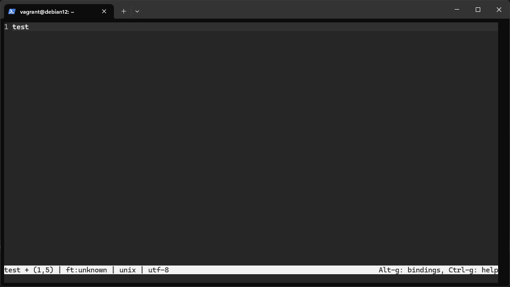
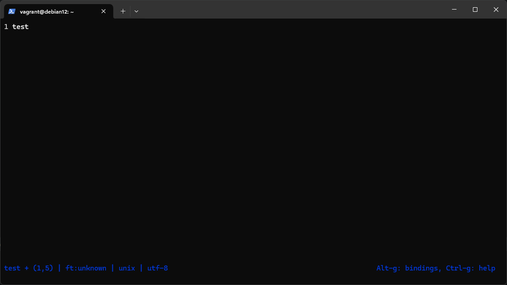
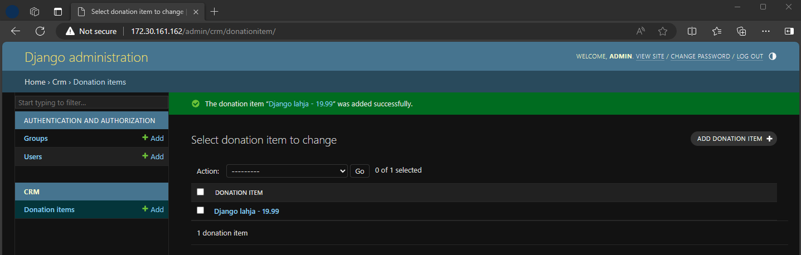

# h7 - Maalisuora

## a) Käännä "Hei maailma" haluamallasi kielellä.

### Python

Tehdään funktio, mikä tulostaa _Hello, World!_ tai annetun syötteen viivalaatikon sisään. Apuna käytetty re-funktiossa [Peter Hansen, Stackoverflow](https://stackoverflow.com/a/65245113).

```python
import re

def maailma(hello = "Hello, World!"):
    print("-" * (len(hello)*2+5))
    print("|" + " " * (len(hello)*2+3) + "|")
    print("|  " + ' '.join(re.findall('.', hello)) + "  |")
    print("|" + " " * (len(hello)*2+3) + "|")
    print("-" * (len(hello)*2+5))
```

Ajetaan:

```python
Python 3.11.8 (tags/v3.11.8:db85d51, Feb  6 2024, 22:03:32) [MSC v.1937 64 bit (AMD64)] on win32
Type "help", "copyright", "credits" or "license" for more information.
>>> import re
>>>
>>> def maailma(hello = "Hello, World!"):
...     print("-" * (len(hello)*2+5))
...     print("|" + " " * (len(hello)*2+3) + "|")
...     print("|  " + ' '.join(re.findall('.', hello)) + "  |")
...     print("|" + " " * (len(hello)*2+3) + "|")
...     print("-" * (len(hello)*2+5))
...
>>> maailma()
-------------------------------
|                             |
|  H e l l o ,   W o r l d !  |
|                             |
-------------------------------
>>> maailma("Käännä maailma")
---------------------------------
|                               |
|  K ä ä n n ä   m a a i l m a  |
|                               |
---------------------------------
```

## b) Laita Linuxiin uusi komento niin, että kaikki käyttäjät voivat ajaa sitä.

Muokataan hieman aikaisempaa Python-koodia sopivampaan muotoon ajettavaksi Linuxilla. Eli ohjelmaa voi ajaa näin: ```pythonkomento "{vaihtoehtoinen tuloste / argumentti}"```.

```python
#!/usr/bin/python3

import re, sys

def maailma(hello = "Hello, World!"):
    print("-" * (len(hello)*2+5))
    print("|" + " " * (len(hello)*2+3) + "|")
    print("|  " + ' '.join(re.findall('.', hello)) + "  |")
    print("|" + " " * (len(hello)*2+3) + "|")
    print("-" * (len(hello)*2+5))

try:
    maailma(sys.argv[1])
except:
    maailma()
```

Ilman _try, except_ muotoa, jos komentoa kutsuu ilman argumenttia, koodi ei toimi koska se yrittää kutsua olematonta. Joten, jos virhe tapahtuu (eli syötetään komento ilman argumenttia: ```pythonkomento```) niin ajetaan funktio _maailma_ ilman syötettä.

Lisätään se järjestelmään kaikkien ajettavaksi:

```console
vagrant@debian12:~$ nano komentopython
vagrant@debian12:~$ sudo chmod +x pythonkomento
vagrant@debian12:~$ sudo cp pythonkomento /usr/local/bin
vagrant@debian12:~$ pythonkomento
-------------------------------
|                             |
|  H e l l o ,   W o r l d !  |
|                             |
-------------------------------
vagrant@debian12:~$ pythonkomento "Käännä maailma"
---------------------------------
|                               |
|  K ä ä n n ä   m a a i l m a  |
|                               |
---------------------------------
```

## c) Ratkaise vanha arvioitava laboratorioharjoitus soveltuvin osin.

Valitsin viimeisimmän, eli viime vuoden kurssitoteutuksen laboratorioharjoituksen.

[Final Lab for Linux Palvelimet 2023](https://terokarvinen.com/2023/linux-palvelimet-2023-arvioitava-laboratorioharjoitus/)

### Isäntäkone
* Windows 11 Pro 23H2
* [Vagrant](https://www.vagrantup.com/) & [Hyper-V](https://en.wikipedia.org/wiki/Hyper-V)
* AMD Ryzen 5 7600X, 32GB RAM ja NVIDIA RTX 2080

#### Vagrant

Alla käyttämäni Vagrantfile, jossa määritellään Debian 12 Bookworm -virtuaalikone.

```ruby
Vagrant.configure("2") do |config|
	config.vm.synced_folder ".", "/vagrant", disabled: true
	config.vm.define "debian", primary: true do |debian|
		debian.vm.box = "generic/debian12"
		debian.vm.provider "hyperv" do |h|
			h.linked_clone = true
			h.cpus = 6
			h.maxmemory = 4096
			h.memory = 4096
			h.vmname = "debian"
		end
	end
end
```

### [c)] Ei kolmea sekoseiskaa
_Suojaa raportti Linux-oikeuksilla niin, että vain oma käyttäjäsi pystyy katselemaan raporttia_

En kirjoita raporttia virtuaalikoneen sisällä, mutta luodaan esimerkki tiedosto ja korjataan sen oikeudet niin, että omistajalla on ainoastaan luku- ja kirjoitusoikeudet.

```console
vagrant@debian12:~$ touch index.md
vagrant@debian12:~$ ls -l index.md
-rw-r--r-- 1 vagrant vagrant 9 Mar  9 20:55 index.md
vagrant@debian12:~$ chmod go-r index.md
vagrant@debian12:~$ ls -l index.md
-rw------- 1 vagrant vagrant 9 Mar  9 20:55 index.md
```

###  [d)] 'hey'
_Tee kaikkien käyttäjien käyttöön komento 'hey'_

Luodaan komento:

```bash
#!/usr/bin/bash

echo "Hey, $USER!"
read -p "Do you want to run 'apt-get moo'? (y/n): " yn

if [ $yn = "y" ]
then
    apt-get moo
    echo "Moo!"
else
    echo "Okay, no 'apt-get moo' for you."
fi
```

Siirretään komento ```/usr/local/bin``` -hakemistoon, jotta se tulee kaikkien käytettäväksi. Testataan komento.

```console
vagrant@debian12:~$ nano hey
vagrant@debian12:~$ chmod +x hey
vagrant@debian12:~$ sudo cp hey /usr/local/bin
vagrant@debian12:~$ hey
Hey, vagrant!
Do you want to run 'apt-get moo'? (y/n): y
                 (__)
                 (oo)
           /------\/
          / |    ||
         *  /\---/\
            ~~   ~~
..."Have you mooed today?"...
Moo!
```

### [e)] 1000x nano
_Asenna micro-editori ja sille jokin plugin (siis micron oma lisäke)._

Asennetaan micro ja [Nord Colors](https://github.com/KiranWells/micro-nord-tc-colors/) -lisäke.

```console
vagrant@debian12:~$ apt-get update
...
vagrant@debian12:~$ sudo apt-get update
...
vagrant@debian12:~$ sudo apt-get install -y micro
...
vagrant@debian12:~$ micro --plugin install nordcolors
...
vagrant@debian12:~$ micro test
```

#### micro test



Asetetaan [Nord Colors](https://github.com/KiranWells/micro-nord-tc-colors/) dokumentaatiosta valiten _nord-16_-teema.

CTRL+E ja syötä ```set colorscheme nord-16```



### [f)] Staattisesti sinun
* _Asenna Apache-weppipalvelin_
* _Tee järjestelmään käyttäjä Erkki Esimerkki tunnuksella "erkki". Lisää Erkin salasana raporttiisi, jotta voit antaa sen Erkille myöhemmin._
* _Tee Erkille kotisivu, joka näkyy osoitteessa http://localhost/~erkki/_

Apache on jo asennettuna. Luodaan käyttäjä _erkki_ ja määritellään Apache.

```console
vagrant@debian12:~$ sudo adduser erkki
...
New password: salasana
...
vagrant@debian12:~$ sudo a2enmod userdir
vagrant@debian12:~$ sudo systemctl restart apache2
vagrant@debian12:~$ su erkki
Password:
erkki@debian12:/home/vagrant$ cd
erkki@debian12:~$ mkdir public_html
erkki@debian12:~$ echo "erkin kotisivu" | tee ./public_html/index.html
erkin kotisivu
erkki@debian12:~$ exit
```

Testataan sivun toiminta.

```console
vagrant@debian12:~$ curl localhost/~erkki
...
  <h1>Not Found</h1><p>The requested resource was not found on this server.</p>
...
vagrant@debian12:~$ ls -l /home/
total 8
drwx------ 3 erkki   erkki   4096 Mar  9 21:27 erkki
drwx--x--x 8 vagrant vagrant 4096 Mar  9 21:15 vagrant
vagrant@debian12:~$ sudo chmod +rx /home/erkki
vagrant@debian12:~$ ls -l /home/
total 8
drwxr-xr-x 3 erkki   erkki   4096 Mar  9 21:27 erkki
drwx--x--x 8 vagrant vagrant 4096 Mar  9 21:15 vagrant
vagrant@debian12:~$ curl http://localhost/~erkki
...
<h1>Moved Permanently</h1>
<p>The document has moved <a href="http://localhost/~erkki/">here</a>.</p>
...
vagrant@debian12:~$ curl localhost/~erkki/index.html
erkin kotisivu
```

Erkin kotikansion oikeuksien muokkaamisen jälkeen (luku- ja suoritusoikeudet kaikille) sivu lähti toimimaan. Curl-komento ei jostain syystä osaa kotihakemistossa näyttää index.html dokumenttia vakio konfiguraatiolla. Osoite http://localhost/~erkki/ kumminkin toimii selaimella.

### [g)] Salattua hallintaa
* _Asenna ssh-palvelin_
* _Tee uusi käyttäjä omalla nimelläsi, esim. minä tekisin "Tero Karvinen test", login name: "terote01"_
* _Automatisoi ssh-kirjautuminen julkisen avaimen menetelmällä, niin että et tarvitse salasanoja, kun kirjaudut sisään. Voit käyttää kirjautumiseen localhost-osoitetta_
* _Vaihda SSH-palvelin kuuntelemaan porttiin 1337/tcp_

Luodaan käyttäjä _sshtest_.

```console
vagrant@debian12:~$ sudo adduser sshtest
...
```

Siirrytään isäntäkoneelle ja kokeillaan SSH-yhdistämistä.

```powershell
PS C:\Users\ojarv> ssh sshtest@172.30.166.166
sshtest@172.30.166.166's password:
Last login: Sat Mar  9 22:22:07 2024 from 172.30.160.1
sshtest@debian12:~$
```

Seuraavaksi luodaan ```.ssh/authorized_keys``` -tiedosto, jotta voidaan SSH-avaimet hyväksyä.

```console
sshtest@debian12:~$ mkdir .ssh
sshtest@debian12:~$ touch .ssh/authorized_keys
sshtest@debian12:~$ exit
logout
Connection to 172.30.166.166 closed.
```

Seuraavaksi siirretään luotu avain isäntäkoneelta virtuaalikoneelle _sshtest_-käyttäjälle. Tässä on käytetty hyväksi [Christopher Hartin](https://chrisjhart.com/Windows-10-ssh-copy-id/) ohjetta, koska Windowsilta ei löydy ```ssh-copy-id``` vastaavaa toimintoa.

```powershell
PS C:\Users\ojarv> ssh-keygen
Generating public/private rsa key pair.
Enter file in which to save the key (C:\Users\ojarv/.ssh/id_rsa):
Enter passphrase (empty for no passphrase):
Enter same passphrase again:
Your identification has been saved in C:\Users\ojarv/.ssh/id_rsa
Your public key has been saved in C:\Users\ojarv/.ssh/id_rsa.pub
The key fingerprint is:
...
PS C:\Users\ojarv> type $env:USERPROFILE\.ssh\id_rsa.pub | ssh sshtest@172.30.166.166 "cat >> .ssh/authorized_keys"
sshtest@172.30.166.166's password:
PS C:\Users\ojarv> ssh sshtest@172.30.166.166
Last login: Sat Mar  9 22:26:06 2024 from 172.30.160.1
```

Kirjautuminen on nyt automatisoitu.

Seuraavaksi laitetaan SSH kuuntelemaan porttia 1337.

```console
vagrant@debian12:~/.ssh$ cd /etc/ssh/
vagrant@debian12:/etc/ssh$ sudoedit sshd_config
vagrant@debian12:/etc/ssh$ grep "Port" sshd_config
Port 22
Port 1337
...
vagrant@debian12:/etc/ssh$ sudo systemctl restart sshd
```

Testataan kirjautumista.

```powershell
PS C:\Users\ojarv> ssh sshtest@172.30.166.166 -p 1337
Last login: Sat Mar  9 22:34:28 2024 from 172.30.160.1
sshtest@debian12:~$
```

Autentikointi on nyt automatisoitu SSH-avaimilla sekä konfiguroitu SSH palvelin virtuaalikoneella kuuntelemaan porttia 1337 portin 22 lisäksi.

### [h)] Djangon lahjat & [h)] Tuotantopropelli
* _Asenna omalle käyttäjällesi Django 4 kehitysympäristö_
* _Tee tietokanta lahjoitetuista esineistä, jossa on nämä ominaisuudet_
    * _Kirjautuminen salasanalla_
    * _Tietokannan muokkaus wepissä Djangon omalla ylläpitoliittymällä (Django admin)_
    * _Käyttäjä Erkille, jossa ei ole ylläpito-oikeuksia_
    * _Taulu Donations, jossa jokaisella tietueella on nimi (name)_
    * _Jos haluat, voit lisäksi bonuksena laittaa mukaan kentän hinta (price)_

* _Jos olet tässä kohdassa, olet kyllä työskennellyt todella nopeasti (tai sitten teet tätä tehtävää huviksesi kurssin jälkeen). Mutta älä huoli, tässä haastetta, jotta et joudu pyörittelemään peukaloita._
* _Tee tuotantotyyppinen asennus Djangosta_
* _Laita Django-lahjatietokanta tuotantotyyppiseen asennukseen_

Vastaavan tehtävän raportoin aikaisemmassa raportissa [h6.md](https://github.com/ojarv/linux-server/blob/main/h6.md), teen tehtävän kyseisen raportin pohjalta. Aloitetaan puhtaasta Vagrantilla provisioidusta virtuaalikoneesta.

```powershell
PS C:\Vagrant> mkdir cleandebian
...
PS C:\Vagrant> cp .\Vagrantfile ./cleandebian/ # Vaihdoin virtuaalikoneen nimen debian -> cleandebian Vagrantfile-tiedostossa
PS C:\Vagrant> cd .\cleandebian\
PS C:\Vagrant\cleandebian> vagrant up
...
PS C:\Vagrant\cleandebian> vagrant ssh cleandebian
vagrant@debian12:~$ 
```

Laitetaan Django pystyyn _Donation Item_ -tietokannalla jossa on kaksi tietuetta, nimi ja hinta.

```console
vagrant@debian12:~$ sudo apt-get update
...
vagrant@debian12:~$ sudo apt-get -y install virtualenv apache2 libapache2-mod-wsgi-py3
...
vagrant@debian12:~$ mkdir django
vagrant@debian12:~$ cd django
vagrant@debian12:~/django$ virtualenv --system-site-packages -p python3 env/
...
vagrant@debian12:~/django$ source env/bin/activate
(env) vagrant@debian12:~/django$ echo "django" | tee requirements.txt
django
(env) vagrant@debian12:~/django$ pip install -r requirements.txt
...
Successfully installed asgiref-3.7.2 django-5.0.3 sqlparse-0.4.4
(env) vagrant@debian12:~/django$ django-admin startproject myproject
(env) vagrant@debian12:~/django$ nano myproject/myproject/settings.py # muokkaa ALLOWED_HOSTS = ['*'] ja lisää 'crm' INSTALLED_APPS listaan
(env) vagrant@debian12:~/django$ cd myproject/
(env) vagrant@debian12:~/django/myproject$ ./manage.py startapp crm
(env) vagrant@debian12:~/django/myproject$ nano crm/models.py
(env) vagrant@debian12:~/django/myproject$ cat crm/models.py
from django.db import models

class DonationItem(models.Model):
    name = models.CharField(max_length=160)
    price = models.DecimalField(max_digits=6, decimal_places=2, default=0)

    def __str__(self):
        return f'{self.name} - {self.price}'
(env) vagrant@debian12:~/django/myproject$ nano crm/admin.py
(env) vagrant@debian12:~/django/myproject$ cat crm/admin.py
from django.contrib import admin
from . import models

admin.site.register(models.DonationItem)
(env) vagrant@debian12:~/django/myproject$ ./manage.py makemigrations
...
(env) vagrant@debian12:~/django/myproject$ ./manage.py migrate
...
(env) vagrant@debian12:~/django/myproject$ ./manage.py createsuperuser
Username (leave blank to use 'vagrant'): admin
...
Superuser created successfully.
```

Seuraavaksi valmistellaan Django tuotantotyyppistä asennusta varten.

```console
(env) vagrant@debian12:~/django/myproject$ nano myproject/settings.py
# Muokkaukset:
# lisää: import os
# lisää: STATIC_ROOT = os.path.join('/home/vagrant/django/myproject/', 'static/')
# muokkaa: DEBUG = False
(env) vagrant@debian12:~/django/myproject$ ./manage.py collectstatic

126 static files copied to '/home/vagrant/django/myproject/static'.
```

Konfiguroidaan Apache.

```console
(env) vagrant@debian12:~/django/myproject$ sudoedit /etc/apache2/sites-available/myproject.conf
```

```/etc/apache2/sites-available/myproject.conf```
```apache
Define TDIR /home/vagrant/django/myproject
Define TWSGI /home/vagrant/django/myproject/myproject/wsgi.py
Define TUSER vagrant
Define TVENV /home/vagrant/django/env/lib/python3.11/site-packages
# See https://terokarvinen.com/2022/deploy-django/

<VirtualHost *:80>
        Alias /static/ ${TDIR}/static/
        <Directory ${TDIR}/static/>
                Require all granted
        </Directory>

        WSGIDaemonProcess ${TUSER} user=${TUSER} group=${TUSER} threads=5 python-path="${TDIR}:${TVENV}"
        WSGIScriptAlias / ${TWSGI}
        <Directory ${TDIR}>
             WSGIProcessGroup ${TUSER}
             WSGIApplicationGroup %{GLOBAL}
             WSGIScriptReloading On
             <Files wsgi.py>
                Require all granted
             </Files>
        </Directory>

</VirtualHost>

Undefine TDIR
Undefine TWSGI
Undefine TUSER
Undefine TVENV
```

```console
(env) vagrant@debian12:~/django/myproject$ sudo a2dissite 000-default.conf
Site 000-default disabled.
...
(env) vagrant@debian12:~/django/myproject$ sudo a2ensite myproject.conf
...
(env) vagrant@debian12:~/django/myproject$ sudo systemctl restart apache2
(env) vagrant@debian12:~/django/myproject$ chmod +x /home/vagrant
```

Tämän jälkeen luodaan paneelissa käyttäjä _Erkki_ sekä tarkastetaan lahjatietokannan toiminta.



## d) Asenna itsellesi tyhjä virtuaalikone
_Asenna itsellesi tyhjä virtuaalikone arvioitavaa labraa varten. Suosittelen Debian 12-Bookworm amd64, riittävästi RAM ja kovalevyä. Koneella saa olla päivitetyt ohjelmistot (apt-get dist-upgrade) ja tulimuuri. Koneella ei saa olla mitään muita demoneja tai ohjelmia asennettuna kuin nuo ja asennuksen mukana tulevat._

Vagrantilla tyhjän koneen asennus hoituu käden käänteessä, minkä tein ylemmän c) tehtävän alussa. Laitoin Karviselle kysymyksen, että onko Vagrantilla provisioiutu virtuaalikone OK, mutta ei ole vielä tullut vastausta (10.3.2024).

## Tehtävänanto

https://terokarvinen.com/2024/linux-palvelimet-2024-alkukevat/
https://terokarvinen.com/2023/linux-palvelimet-2023-arvioitava-laboratorioharjoitus/